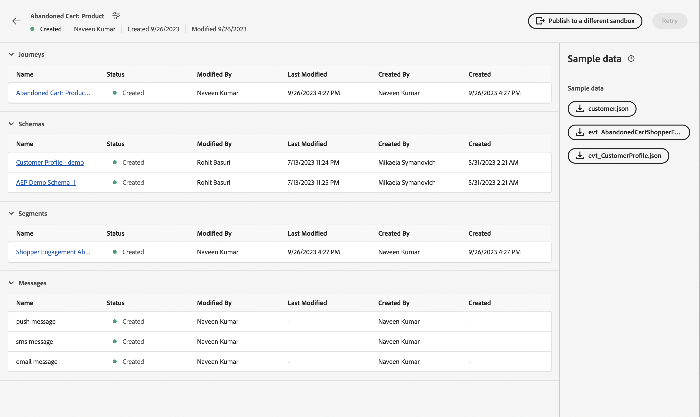
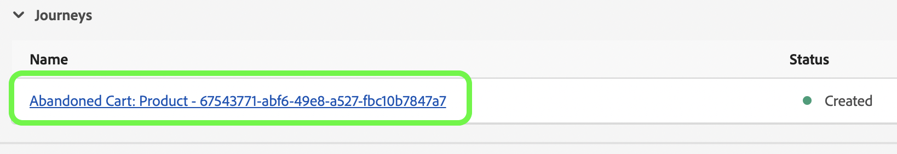
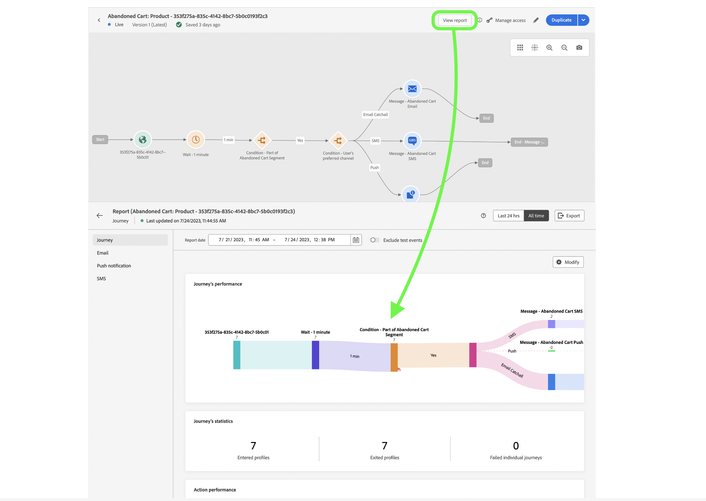

# Unitary event

## Steps to follow {#steps-to-follow}

>[!CONTEXTUALHELP]
>id="marketerexp_sampledata_unitaryevent"
>title="How to use?"
>abstract="Please follow the link for more details"

>[!IMPORTANT]
>
>These instructions might change across **[!UICONTROL Playbook]** so please always refer the Sample data section of respective **[!UICONTROL Playbook]**.

## Prerequisite

* Use Playbook to create the instances assets like **[!UICONTROL Journey]**, **[!UICONTROL Schemas]**, **[!UICONTROL Segments]**, **[!UICONTROL Messages]** etc.

* Created assets will be shown on `Bill Of Material` Page

<!-- TODO: attached image needs to change once postman is removed from UI -->


>[!PRO-TIP]
>
>If you are using a terminal to run the curls, you can set variable values before running the curls so that there is no need to replace those values in individual curls.
>For e.g: If you set `ORG_ID=************@AdobeOrg`, shell will automatically substitue every occurrence of `$ORG_ID` with the value, so you can copy, paste, and execute the curls below without any modification.

## Fetch IMS Token

1. Please follow [Authenticate and access Experience Platform APIs](https://experienceleague.adobe.com/docs/experience-platform/landing/platform-apis/api-authentication.html) documentation to generate the Access Token.

## Publish the Journey created by Playbook

There are 2 ways to publish the journey; you may choose any of them:

1. **Using the AJO UI** - click on the Journey link on `Bill Of Material Page`; this will redirect you to Journey page there you can click on **[!UICONTROL Publish]** button and Journey would be published.

   

1. **Using cURL**

    1. Publish the journey. The response will contain job id needed in next step to fetch journey publish status.

        ```bash
        curl --location --request POST "https://journey-private.adobe.io/authoring/jobs/journeyVersions/$JOURNEY_ID/deploy" \
        --header "Accept: */*" \
        --header "Authorization: Bearer $ACCESS_TOKEN" \
        --header "x-api-key: $API_KEY" \
        --header "x-gw-ims-org-id: $ORG_ID" \
        --header "x-sandbox-name: $SANDBOX_NAME" \
        --header "Content-Type: application/json" 
        ```

    1. Journey publish might take some time, so in order to check the status execute below cURL, until the `response.status` is `SUCCESS`, make sure to wait 10-15 seconds if journey publish takes time.

        ```bash
        curl --location "https://journey-private.adobe.io/authoring/jobs/$JOB_ID" \
        --header "Authorization: Bearer $ACCESS_TOKEN" \
        --header "x-api-key: $API_KEY" \
        --header "x-gw-ims-org-id: $ORG_ID" \
        --header "x-sandbox-name: $SANDBOX_NAME" \
        --header "Content-Type: application/json"
        ```

## Ingest the Customer Profile

>[!TIP]
>
>If your email provider supports plus emails, you can reuse the same email address by appending `+<variable>` into your email e.g. `usertest@email.com` can be resued as `usertest+v1@email.com` or `usertest+24jul@email.com`. This would be helpful to have a fresh profile each time, but still using the same email id.
>
>P.S: Plus emails are a configurable feature which needs to be supported by email provider. Please check if you are able to receive emails on such addresses before using them in test.

1. First-time user needs to create the **[!DNL customer dataset]** and **[!DNL HTTP Streaming Inlet Connection]**.
1. If you already have created the **[!DNL customer dataset]** and **[!DNL HTTP Streaming Inlet Connection]**, please skip to the step `5`.
1. Create a customer profile dataset by executing the below cURL.

    ```bash
    curl --location "https://platform.adobe.io/data/foundation/catalog/dataSet" \
    --header "Authorization: Bearer $ACCESS_TOKEN" \
    --header "x-gw-ims-org-id: $ORG_ID" \
    --header "x-sandbox-name: $SANDBOX_NAME" \
    --header "x-api-key: $API_KEY" \
    --header "Content-Type: application/json" \
    --data '{
        "name": "'$PROFILE_DATASET_NAME'",
        "schemaRef": {
            "id": "'$PROFILE_SCHEMA_REF'",
            "contentType": "application/vnd.adobe.xed-full-notext+json; version=1"
        },
        "tags": {
            "unifiedProfile": [
            "enabled:true"
            ],
            "unifiedIdentity": [
            "enabled:true"
            ]
        },
        "fileDescription": {
            "persisted": true,
            "containerFormat": "parquet",
            "format": "parquet"
        }
    }'
    ```

    The response will be of the format `"@/dataSets/<PROFILE_DATASET_ID>"`. 

1. Create **[!DNL HTTP Streaming Inlet Connection]** with help of following steps.
    1. Create a base connection.

        ```bash
        curl --location "https://platform.adobe.io/data/foundation/flowservice/connections?Cache-Control=no-cache" \
        --header "Authorization: Bearer $ACCESS_TOKEN" \
        --header "x-gw-ims-org-id: $ORG_ID" \
        --header "x-sandbox-name: $SANDBOX_NAME" \
        --header "x-api-key: $API_KEY" \
        --header "Content-Type: application/json" \
        --data '{
            "name": "AbandonedCartProduct_Base_ConnectionForCustomerProfile_1694458293",
            "description": "Marketer Playground Playbook-Validation Customer Profile Base Connection 1",
            "auth": {
                "specName": "Streaming Connection",
                "params": {
                    "dataType": "xdm"
                }
            },
            "connectionSpec": {
                "id": "bc7b00d6-623a-4dfc-9fdb-f1240aeadaeb",
                "version": "1.0"
            }
        }'
        ```

        Obtain base connection id from the response and use it in place of `PROFILE_BASE_CONNECTION_ID` in following cURLs

    1. Create source connection. 

        ```bash
        curl --location "https://platform.adobe.io/data/foundation/flowservice/sourceConnections" \
        --header "Authorization: Bearer $ACCESS_TOKEN" \
        --header "x-gw-ims-org-id: $ORG_ID" \
        --header "x-sandbox-name: $SANDBOX_NAME" \
        --header "Content-Type: application/json" \
        --header "x-api-key: $API_KEY" \
        --data '{
            "name": "AbandonedCartProduct_Source_ConnectionForCustomerProfile_1694458318",
            "description": "Marketer Playground Playbook-Validation Customer Profile Source Connection 1",
            "baseConnectionId": "'$PROFILE_BASE_CONNECTION_ID'",
            "connectionSpec": {
                "id": "bc7b00d6-623a-4dfc-9fdb-f1240aeadaeb",
                "version": "1.0"
            }
        }'
        ```

        Obtain source connection id from the response and use it in place of `PROFILE_SOURCE_CONNECTION_ID`

    1. Create target connection.

        ```bash
        curl --location "https://platform.adobe.io/data/foundation/flowservice/targetConnections" \
        --header "Authorization: Bearer $ACCESS_TOKEN" \
        --header "x-gw-ims-org-id: $ORG_ID" \
        --header "x-sandbox-name: $SANDBOX_NAME" \
        --header "Content-Type: application/json" \
        --header "x-api-key: $API_KEY" \
        --data '{
            "name": "AbandonedCartProduct_Target_ConnectionForCustomerProfile_1694458407",
            "description": "Marketer Playground Playbook-Validation Customer Profile Target Connection 1",
            "data": {
                "format": "parquet_xdm",
                "schema": {
                    "version": "application/vnd.adobe.xed-full+json;version=1",
                    "id": "'$PROFILE_SCHEMA_REF'"
                },
                "properties": null
            },
            "connectionSpec": {
                "id": "c604ff05-7f1a-43c0-8e18-33bf874cb11c",
                "version": "1.0"
            },
            "params": {
                "dataSetId": "'$PROFILE_DATASET_ID'"
            }
        }'
        ```

        Obtain target connection id from the response and use it in place of `PROFILE_TARGET_CONNECTION_ID`

    1. Create a dataflow.

        ```bash
        curl --location "https://platform.adobe.io/data/foundation/flowservice/flows" \
        --header "Authorization: Bearer $ACCESS_TOKEN" \
        --header "x-gw-ims-org-id: $ORG_ID" \
        --header "x-sandbox-name: $SANDBOX_NAME" \
        --header "Content-Type: application/json" \
        --header "x-api-key: $API_KEY" \
        --data '{
            "name": "AbandonedCartProduct_Dataflow_ForCustomerCustomerProfile_1694460528",
            "description": "Marketer Playground Playbook-Validation Customer Profile Dataflow 1",
            "flowSpec": {
                "id": "d8a6f005-7eaf-4153-983e-e8574508b877",
                "version": "1.0"
            },
            "sourceConnectionIds": [
                "'$PROFILE_SOURCE_CONNECTION_ID'"
            ],
            "targetConnectionIds": [
                "'$PROFILE_TARGET_CONNECTION_ID'"
            ]
        }'
        ```

    1. Get Base Connection. The result will contain inletUrl required to send profile data.

        ```bash
        curl --location "https://platform.adobe.io/data/foundation/flowservice/connections/$PROFILE_BASE_CONNECTION_ID" \
        --header "Authorization: Bearer $ACCESS_TOKEN" \
        --header "x-gw-ims-org-id: $ORG_ID" \
        --header "x-sandbox-name: $SANDBOX_NAME" \
        --header "Content-Type: application/json" \
        --header "x-api-key: $API_KEY"
        ```

        Obtain inletUrl from the response and use it in place of `PROFILE_INLET_URL`

1. At this step user must have values of `PROFILE_DATASET_ID` and `PROFILE_INLET_URL`; if not, please refer step `3` or `4` respectively.
1. To ingest customer, user need to replace `CUSTOMER_MOBILE_NUMBER`, `CUSTOMER_FIRST_NAME`, `CUSTOMER_LAST_NAME` and `EMAIL` in below cURLs.

    1. `CUSTOMER_MOBILE_NUMBER` would be mobile number e.g. `+1 000-000-0000`
    1. `CUSTOMER_FIRST_NAME` would be the first name of user
    1. `CUSTOMER_LAST_NAME` would be the last name of user
    1. `EMAIL` would be the email address of user, this is crucial to use distinct email id so that a fresh profile can be ingested.

1. Finally execute the curl to ingest customer profile. Update `body.xdmEntity.consents.marketing.preferred` to `email`, `sms`, or `push` based on the channels you intend to verify. Also set corresponding `val` to `y`.

    ```bash
    curl --location "$PROFILE_INLET_URL?synchronousValidation=true" \
    --header 'Content-Type: application/json' \
    --data-raw '{
        "header": {
            "schemaRef": {
                "id": "'$PROFILE_SCHEMA_REF'",
                "contentType": "application/vnd.adobe.xed-full+json;version=1.0"
            },
            "imsOrgId": "'$ORG_ID'",
            "datasetId": "'$PROFILE_DATASET_ID'",
            "source": {
                "name": "Streaming dataflow - 1694460605"
            }
        },
        "body": {
            "xdmMeta": {
                "schemaRef": {
                    "id": "'$PROFILE_SCHEMA_REF'",
                    "contentType": "application/vnd.adobe.xed-full+json;version=1.0"
                }
            },
            "xdmEntity": {
            "consents": {
                "marketing": {
                    "preferred": "email",
                    "email": {
                        "val": "y"
                    },
                    "push": {
                        "val": "n"
                    },
                    "sms": {
                        "val": "n"
                    }
                }
            },
            "mobilePhone": {
                "number": "'$CUSTOMER_MOBILE_NUMBER'",
                "status": "active"
            },
            "person": {
                "name": {
                "firstName": "'$CUSTOMER_FIRST_NAME'",
                "lastName": "'$CUSTOMER_LAST_NAME'"
                }
            },
            "personalEmail": {
                "address": "'$EMAIL'"
            },
            "testProfile": false
            }
        }
    }'
    ```

## Ingest Journey Trigger Event

1. First time user need to create the **[!DNL event dataset]** and **[!DNL HTTP Streaming Inlet Connection for events]**
1. If you already have created the **[!DNL event dataset]** and **[!DNL HTTP Streaming Inlet Connection for events]**, please skip to the step `5`.
1. Create an event dataset by executing the below cURL.

    ```bash
    curl --location "https://platform.adobe.io/data/foundation/catalog/dataSet" \
    --header "Authorization: Bearer $ACCESS_TOKEN" \
    --header "x-gw-ims-org-id: $ORG_ID" \
    --header "x-sandbox-name: $SANDBOX_NAME" \
    --header "x-api-key: $API_KEY" \
    --header "Content-Type: application/json" \
    --data '{
        "name": "'$EVENT_DATASET_NAME'",
        "schemaRef": {
            "id": "'$EVENT_SCHEMA_REF'",
            "contentType": "application/vnd.adobe.xed-full-notext+json; version=1"
        },
        "tags": {
            "unifiedProfile": [
                "enabled:true"
            ],
            "unifiedIdentity": [
                "enabled:true"
            ]
        },
        "fileDescription": {
            "persisted": true,
            "containerFormat": "parquet",
            "format": "parquet"
        }
    }'
    ```
    
    The response will be of the format `"@/dataSets/<EVENT_DATASET_ID>"`

1. Create **[!DNL HTTP Streaming Inlet Connection for events]**  with help of following steps.
    <!-- TODO: Is the name unique? If so, we may need to generate and provide in variables.txt-->
    1. Create a base connection.

        ```bash
        curl --location "https://platform.adobe.io/data/foundation/flowservice/connections?Cache-Control=no-cache" \
        --header "Authorization: Bearer $ACCESS_TOKEN" \
        --header "x-gw-ims-org-id: $ORG_ID" \
        --header "x-sandbox-name: $SANDBOX_NAME" \
        --header "x-api-key: $API_KEY" \
        --header "Content-Type: application/json" \
        --data '{
            "name": "AbandonedCartProduct_Base_ConnectionForAEPDemoSchema_1694461448",
            "description": "Marketer Playground Playbook-Validation AEP Demo Schema Base Connection 1",
            "auth": {
                "specName": "Streaming Connection",
                "params": {
                    "dataType": "xdm"
                }
            },
            "connectionSpec": {
                "id": "bc7b00d6-623a-4dfc-9fdb-f1240aeadaeb",
                "version": "1.0"
            }
        }'
        ```

        Obtain base connection id from the response and use it in place of `EVENT_BASE_CONNECTION_ID`

    1. Create source connection.

        ```bash
        curl --location "https://platform.adobe.io/data/foundation/flowservice/sourceConnections" \
        --header "Authorization: Bearer $ACCESS_TOKEN" \
        --header "x-gw-ims-org-id: $ORG_ID" \
        --header "x-sandbox-name: $SANDBOX_NAME" \
        --header "x-api-key: $API_KEY" \
        --header "Content-Type: application/json" \
        --data '{
            "name": "AbandonedCartProduct_Source_ConnectionForAEPDemoSchema_1694461464",
            "description": "Marketer Playground Playbook-Validation AEP Demo Schema Source Connection 1",
            "baseConnectionId": "'$EVENT_BASE_CONNECTION_ID'",
            "connectionSpec": {
                "id": "bc7b00d6-623a-4dfc-9fdb-f1240aeadaeb",
                "version": "1.0"
            }
        }'
        ```

        Obtain source connection id from the response and use it in place of `EVENT_SOURCE_CONNECTION_ID`

    1. Create target connection.

        ```bash
        curl --location "https://platform.adobe.io/data/foundation/flowservice/sourceConnections" \
        --header "Authorization: Bearer $ACCESS_TOKEN" \
        --header "x-gw-ims-org-id: $ORG_ID" \
        --header "x-sandbox-name: $SANDBOX_NAME" \
        --header "x-api-key: $API_KEY" \
        --header "Content-Type: application/json" \
        --data '{
            "name": "AbandonedCartProduct_Target_ConnectionForAEPDemoSchema_1694802667",
            "description": "Marketer Playground Playbook-Validation AEP Demo Schema Target Connection 1",
            "data": {
                "format": "parquet_xdm",
                "schema": {
                    "version": "application/vnd.adobe.xed-full+json;version=1",
                    "id": "'$EVENT_SCHEMA_REF'"
                },
                "properties": null
            },
            "connectionSpec": {
                "id": "c604ff05-7f1a-43c0-8e18-33bf874cb11c",
                "version": "1.0"
            },
            "params": {
                "dataSetId": "'$EVENT_DATASET_ID'"
            }
        }'
        ```

        Obtain target connection id from the response and use it in place of `EVENT_TARGET_CONNECTION_ID`

    1. Create a dataflow.

        ```bash
        curl --location "https://platform.adobe.io/data/foundation/flowservice/flows" \
        --header "Authorization: Bearer $ACCESS_TOKEN" \
        --header "x-gw-ims-org-id: $ORG_ID" \
        --header "x-sandbox-name: $SANDBOX_NAME" \
        --header "x-api-key: $API_KEY" \
        --header "Content-Type: application/json" \
        --data '{
            "name": "AbandonedCartProduct_Dataflow_ForCustomerAEPDemoSchema_1694461564",
            "description": "Marketer Playground Playbook-Validation AEP Demo Schema Dataflow 1",
            "flowSpec": {
                "id": "d8a6f005-7eaf-4153-983e-e8574508b877",
                "version": "1.0"
            },
            "sourceConnectionIds": [
                "'$EVENT_SOURCE_CONNECTION_ID'"
            ],
            "targetConnectionIds": [
                "'$EVENT_TARGET_CONNECTION_ID'"
            ]
        }'
        ```

    1. Get Base Connection. The result will contain inletUrl required to send profile data.

    ```bash
    curl --location "https://platform.adobe.io/data/foundation/flowservice/connections/$EVENT_BASE_CONNECTION_ID" \
        --header "Authorization: Bearer $ACCESS_TOKEN" \
        --header "x-gw-ims-org-id: $ORG_ID" \
        --header "x-sandbox-name: $SANDBOX_NAME" \
        --header "x-api-key: $API_KEY" \
        --header "Content-Type: application/json" 
    ```

    Obtain inletUrl from the response and use it in place of `EVENT_INLET_URL`

1. At this step user must have values of `EVENT_DATASET_ID` and `EVENT_INLET_URL`; if not, please refer step `3` or `4` respectively.
1. To ingest event, user need to change the time variable `TIMESTAMP` in request body of cURL below.

    1. Replace `body.xdmEntity` with contents of downloaded event json.
    1. `TIMESTAMP` would the time of event occurance, use the timestamp in UTC timezone e.g. `2023-09-05T23:57:00.071+00:00`.
    1. Set a unique value for variable `UNIQUE_EVENT_ID`.

    ```bash
    curl --location "$EVENT_INLET_URL?synchronousValidation=true" \
    --header 'Content-Type: application/json' \
    --data-raw '{
        "header": {
            "schemaRef": {
                "id": "'$EVENT_SCHEMA_REF'",
                "contentType": "application/vnd.adobe.xed-full+json;version=1.0"
            },
            "imsOrgId": "'$ORG_ID'",
            "datasetId": "'$EVENT_DATASET_ID'",
            "source": {
                "name": "Streaming dataflow - 8/31/2023 9:04:25 PM"
            }
        },
        "body": {
            "xdmMeta": {
                "schemaRef": {
                    "id": "'$EVENT_SCHEMA_REF'",
                    "contentType": "application/vnd.adobe.xed-full+json;version=1.0"
                }
            },
            "xdmEntity": {
                "endUserIDs": {
                    "_experience": {
                        "aaid": {
                            "id": "'$EMAIL'"
                        },
                        "emailid": {
                            "id": "'$EMAIL'"
                        }
                    }
                },
                "_experience": {
                    "analytics": {
                        "customDimensions": {
                            "eVars": {
                            "eVar235": "AC11147"
                            }
                        }
                    }
                },
                "_id": "'$UNIQUE_EVENT_ID'",
                "commerce": {
                    "productListAdds": {
                        "value": 11498
                    }
                },
                "eventType": "commerce.productListAdds",
                "productListItems": [
                    {
                        "_id": "ACS1620",
                        "SKU": "P1",
                        "_experience": {
                            "analytics": {
                            "customDimensions": {
                                "eVars": {
                                    "eVar1": "Pants"
                                }
                            }
                            }
                        },
                        "currencyCode": "USD",
                        "name": "Sample value",
                        "priceTotal": 30841.13,
                        "product": "https://ns.adobe.com/xdm/common/uri",
                        "productAddMethod": "Sample value",
                        "quantity": 1
                    },
                    {
                        "_id": "ACS1729",
                        "SKU": "P2",
                        "_experience": {
                            "analytics": {
                                "customDimensions": {
                                    "eVars": {
                                        "eVar1": "Galliano"
                                    }
                                }
                            }
                        },
                        "currencyCode": "USD",
                        "name": "Sample value",
                        "priceTotal": 20841.13,
                        "product": "https://ns.adobe.com/xdm/common/uri",
                        "productAddMethod": "Sample value",
                        "quantity": 2
                    }
                ],
                "timestamp": "'$TIMESTAMP'",
                "web": {
                    "webInteraction": {
                        "URL": "https://experienceleague.adobe.com/docs/experience-platform/edge/data-collection/collect-commerce-data.html?lang=en",
                        "name": "Sample value",
                        "region": "Sample value"
                    },
                    "webPageDetails": {
                        "URL": "https://experienceleague.adobe.com/docs/experience-platform/edge/data-collection/collect-commerce-data.html?lang=en",
                        "isErrorPage": false,
                        "isHomePage": false,
                        "name": "Sample value",
                        "pageViews": {
                            "id": "Sample value",
                            "value": 1
                        },
                        "server": "Sample value",
                        "siteSection": "Sample value",
                        "viewName": "Sample value"
                    },
                    "webReferrer": {
                    "URL": "Sample value",
                    "type": "internal"
                    }
                }
            }
        }
    }'
    ```

## Final Validation

You must receive a message on your selected preferred channel used in **[!DNL Ingest the Customer Profile]** step `8`

* `SMS` if preferred channel is `sms` on `customer_country_code` and `customer_mobile_no`
* `Email` if preferred channel is `email` on `email`

Alternatively you can check `Journey Report`, to check it click on `Journey Object` on `Bill of Materials page` this will redirect you to `Journey Details page`.

For any published Journey user must get a **[!UICONTROL View report]** button



## Clean up

Please do not have the multiple instances of `Journey` running simultaneously, kindly stop the Journey if it is only for validation once the validation is completed.
