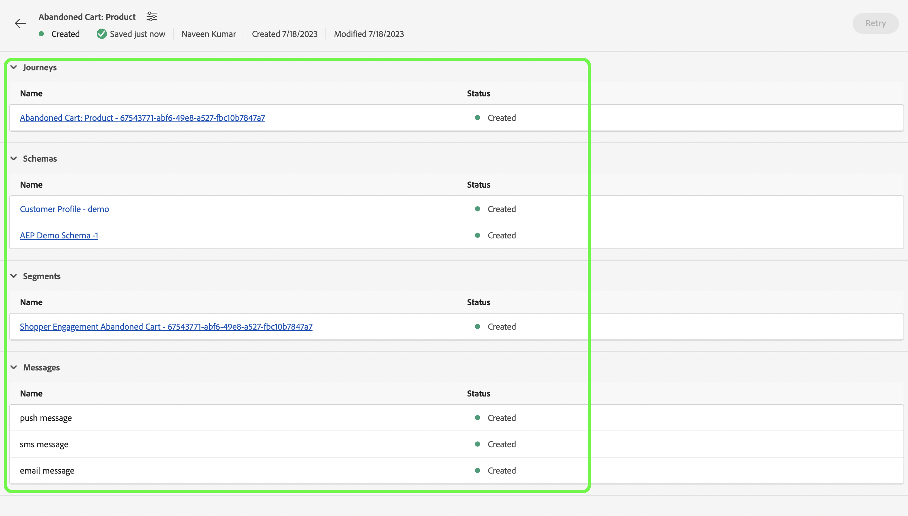

# Steps to follow

>[!IMPORTANT]
>
>These instructions might change across **[!UICONTROL Playbook]** so please always refer the Sample data section of respective **[!UICONTROL Playbook]** 

## Prerequisite
* You must have the Postman software installed
* Use Playbook to create the instances assets like **[!UICONTROL Journey]**, **[!UICONTROL Schemas]**, **[!UICONTROL Segments]**, **[!UICONTROL Messages]** etc.

Below is `Playbook Instance Objects Page`

## Prepare Postman with required collection
1. Visit **[!UICONTROL Use Case Playbook]** application
2. Click on the respective **[!UICONTROL Playbook]** card to visit **[!UICONTROL Playbook]** details page
3. Scroll down to the **[!UICONTROL Sample data]** section on the detail page

4. Download the `postman.json` and `customer.json` by clicking the respective buttons on the UI
5. Import `postman.json` in the **[!DNL Postman Software]**
6. Create a dedicated Postman Environment for this validation e.g. `Adobe <PLAYBOOK_NAME>`

## Fetch IMS Token
1. Please follow [Authenticate and access Experience Platform APIs](https://experienceleague.adobe.com/docs/experience-platform/landing/platform-apis/api-authentication.html) documentation to generate the Access Token.
2. Store the Access Token value in Environment variables named `ACCESS_TOKEN`.
>!Note
>
>All Environment variables are case sensitive so please always use the exact variable name.

3. Store other authentication related values like `API_KEY`, `IMS_ORG` and `SANDBOX_NAME` in Environment variables
>!Important
>
>Before executing any API from Postman make sure all required Environment variables must be added

## Publish the Journey created by Playbook
There are 2 ways to publish the journey, you may opt any of them:
1. **Using the AJO UI** - click on the Journey link on `Playbook Instance Objects Page`, this will redirect you to Journey page there you can click on **[!UICONTROL Publish]** button and Journey would be published.

2. **Using the Postman API**
    1. Store the `JOURNEY_VERSION_ID` in Environment variables
    2. Trigger **[!DNL Publish Journey]** request 
    3. Journey publish might take some time, so in order to check the status execute the Check Journey publish status API, until the `resonse.status` is `SUCCESS`, make sure to wait 10-15 seconds if journey publish takes time.
    >!Note
    >
    >All Environment variables are case sensitive so please always use the exact variable name.

## Ingest the Customer Profile
1. Store the `customer_schema_id` in Environment variables, `customer_schema_id` can be fetched from `Customer Profile` schema on `Playbook Instance Objects Page`.
2. Use **[!DNL Create Dataset for Customer]** 
3. Edit emailId, mobile number for sms in customer data
4. TODO ingest customer

## Ingest Event
1. Store the `analytics_schema_id` in Environment variables, `analytics_schema_id` can be fetched from `AEP Demo Schema` schema on `Playbook Instance Objects Page`.
2. Use **[!DNL Create Dataset for Event]** 
3. use the same emailId which we used while ingesting the customer, in event payload
4. Change the event timestamp back to 30 mins so that we immdiately becomes abandoned cart segment candidate
4. TODO ingest event

## Final Validation
An email or a sms must come on your provided email address or mobile number in customer ingestion.
Also you can check the Journey report from AJO journey Report